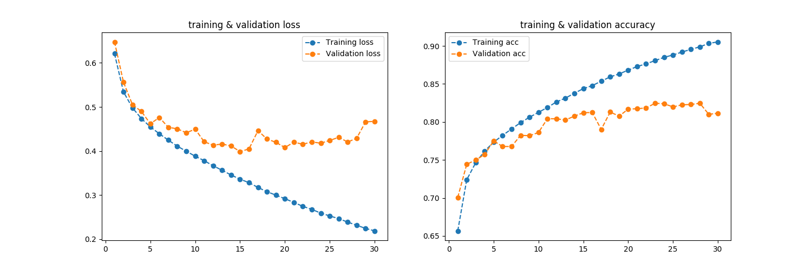

# Similar question identification

# Problem statement
Quora Question Pairs
The task is to identify question pairs that have the same intent?

# Description
Many people on Quora ask questions with same intent in different wordings. 
For better user experience on quora, these questions should be merged together so that writers do not need to answer same question multiple times.
Also it will make discovery of content easier on quora. The task is to create a deep learning model to identify duplicate questions.

# Strategy
Train a binary classifier with two separate embedding layer each for question1 and question2. The embedding layers are initialized with
glove 300d vectors. The model is trained with binary cross entropy, predicting if the questions are same or different.

## Data creation process
- splitting data into train test
- questions's data encoding, padding and trauncating
- creating embedding weights

## training the model on the created dataset

 

Training the model yields accuracy of ~82% on the test dataset.

## Further improvements:
- training a siamese network with triplet loss
- using bert fine tuning for similarity prediction

## code understanding

- data_processing.py: A script with methods for text data creation for model training.
- model.py: A script with model architecture and training code.
- inference.py: A script with two sentences as input and binary(yes/no) output indicating if sentences are duplicates

Note: Trained model weights can be downloaded from [here](https://model-specific-public-storage.s3.amazonaws.com/que_similarity/quora_weights.h5)

